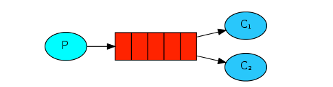
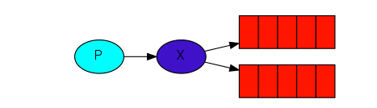
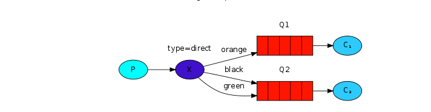
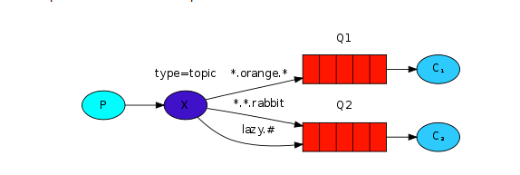
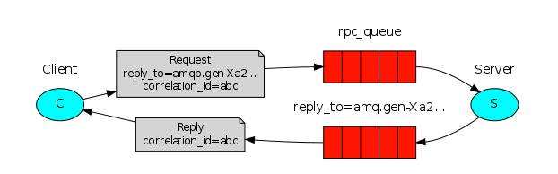

# 工作模式介绍

## 知识储备：

**交换机：**

​	RabbitMQ中有4中交换机，分别是

1. **（FANOUT）扇形交换机**:

   扇形交换机是最基本的交换机类型，它所能做的事情非常简单———广播消息。扇形交换机会把能接收到的消息全部发送给绑定在自己身上的队列。因为广播不需要“思考”，所以**扇形交换机处理消息的速度也是所有的交换机类型里面最快的**。

2. **（DIRECT）直连交换机**

   直连交换机是一种带路由功能的交换机，一个队列会和一个交换机绑定，除此之外再绑定一个`routing_key`，当消息被发送的时候，需要指定一个`binding_key`，这个消息被送达交换机的时候，就会被这个交换机送到指定的队列里面去。同样的一个`binding_key`也是支持应用到多个队列中的。

   这样当一个交换机绑定多个队列，就会被送到对应的队列去处理。对应的工作模式就是Routing,路由模式

   **适用场景**：有优先级的任务，根据任务的优先级把消息发送到对应的队列，这样可以指派更多的资源去处理高优先级的队列。

3. **（TOPIC） 主题交换机，也叫通配符交换机**

   直连交换机的`routing_key`方案非常简单，如果我们希望一条消息发送给多个队列，那么这个交换机需要绑定上非常多的`routing_key`，假设每个交换机上都绑定一堆的`routing_key`连接到各个队列上。那么消息的管理就会异常地困难。

   所以`RabbitMQ`提供了一种主题交换机，发送到主题交换机上的消息需要携带指定规则的`routing_key`，主题交换机会根据这个规则将数据发送到对应的(多个)队列上。

   主题交换机的`routing_key`需要有一定的规则，交换机和队列的`binding_key`需要采用`*.#.*.....`的格式，每个部分用`.`分开，其中：

   - `*`表示一个单词
   - `#`表示任意数量（零个或多个）单词。

   假设有一条消息的`routing_key`为`fast.rabbit.white`,那么带有这样`binding_key`的几个队列都会接收这条消息：

   1. fast.\*.*
   2. \*.*.white
   3. fast.#

4. **（HEADER）首部交换机**

   ​	首部交换机是忽略`routing_key`的一种路由方式。路由器和交换机路由的规则是通过`Headers`信息来交换的，这个有点像`HTTP`的`Headers`。将一个交换机声明成首部交换机，绑定一个队列的时候，定义一个`Hash`的数据结构，消息发送的时候，会携带一组hash数据结构的信息，当`Hash`的内容匹配上的时候，消息就会被写入队列。

   ​	绑定**交换机**和**队列**的时候，Hash结构中要求携带一个键**“x-match”**，这个键的`Value`可以是`any`或者`all`，这代表消息携带的`Hash`是需要**全部匹配**(all)，还是**仅匹配一个键**(any)就可以了。相比直连交换机，首部交换机的优势是匹配的规则**不被**限定为字符串(string)。

------

 **消息始终都是先发送到交换机，由交换机经过路由传送给队列，消费者再从队列中获取消息的！**

------

## Work queues：[工作队列模式](https://www.rabbitmq.com/tutorials/tutorial-two-java.html)



​	工作队列模式背后的设计理念主要是为了避免立即执行一个资源资源密集型的任务，并且不得不等待它完成。取而代之的，我们计划将这个任务延期执行。我们将这个任务压缩成一个消息并发送到队列。后台运行的程序会取出这个任务并执行它。当后台有多个执行器时，任务将会在他们之间共享。


​	工作队列模式，默认采用轮询的方式将消息发送给消费者，平均来说，每个消费者都会得到同样数量的消息。需要注意的是，工作队列模式中，一条消息只会被一个消费者消费。

​	我们上篇文章实现的案例其实就是工作队列模式，虽然在上面的图中，没有体现出交换机，在代码中我们也没有声明交换机，但实际上，MQ会使用一个默认的交换机。*默认交换机*(default exchange)实际上是一个由消息代理预先声明好的没有名字(名字为空字符串)的直连交换机(direct exchange）。关于交换机的概念，我们在后面会继续提到，在这里就不多说了。接下来我们看第二种工作模式：

## Publish/Subscribe：[发布订阅模式](<https://www.rabbitmq.com/tutorials/tutorial-three-java.html>)



​	

​	相比于工作队列模式，发布订阅模式会有很大的不同，在工作队列模式中，每个任务只会分派给一个指定的消费者，但是在发布订阅模式中，我们会将信息发布给每一个订阅者。从上面的模型图的对比我们也可以发先，发布订阅模式显式的指明了需要使用到交换机。

​	**应用场景：**

​	设想我们现在有一个日志系统，对于这个日志系统我们需要提供两个功能，一个是将日志写入到磁盘中，另外一个是将日志显示到屏幕上，如果我们采用工作队列的模式，我们可能会这样做：

1. 确定一个队列，队列中存放我们的任务，我们将其称为LogTaskQueue
2. 我们相对应的要有两个服务，一个专门处理，**日志写入到磁盘**这一任务，而另一个专门初始**将日志显示到屏幕上**这一任务，这两个服务都监听了LogTaskQueue，但是对于监听到的消息会做不同的处理

这种情况下，由于工作队列模式下，消息是轮流被消费者监听到的，对于我们系统而言，每次只能收到来自MQ的一个任务，这样的话，效率会很低

​	而在发布订阅模式下，MQ会通过交换机将消息同时发送到多个队列中，这样在上面的场景中，我们的两个服务能同时收到消息并做处理，很明显，效率会提高

​	**代码实现：**

1. 生产者,假设为我们的日志系统

   ```java
   public class ProducerApplication {
   
       public static final String QUEUE_NAME_WRITE = "write";
       public static final String QUEUE_NAME_SHOW = "show";
       public static final String EXCHANGE_FANOUT_NAME = "FANOUT";
   
       public static void main(String[] args) {
           // 建立连接
           ConnectionFactory factory = new ConnectionFactory();
           factory.setHost("127.0.0.1");
           factory.setPort(5672);
           factory.setUsername("guest");
           factory.setPassword("guest");
           // 设置虚拟机，一个虚拟机相当于一个独立的mq
           factory.setVirtualHost("/");
           Connection connection = null;
           Channel channel = null;
           try {
               connection = factory.newConnection();
               // 建立通道
               channel = connection.createChannel();
               // 声明交换机
               /**
                * String exchange, 交换机名称
                * String type,  交换机类型
                * boolean durable  是否持久化
                */
               channel.exchangeDeclare(EXCHANGE_FANOUT_NAME, BuiltinExchangeType.FANOUT, false);
               // 声明队列
               /**
                * @params 参数列表：
                * String queue: 声明的队列名称
                * boolean durable：消息是否持久化，若设置为true，则MQ重启后，队列仍然存在
                * boolean exclusive：是否独占连接，设置为true,连接关闭则队列被删除，一般用于临时队列的创建，跟autoDelete配合使用
                * boolean autoDelete：是否自动删除，设置为true,则队列不使用就自动删除，一般用于临时队列的创建
                * Map<String, Object> arguments：设置队列的一些扩展参数
                */
               channel.queueDeclare(QUEUE_NAME_WRITE, true, false, false, null);
               channel.queueDeclare(QUEUE_NAME_SHOW, true, false, false, null);
   
               // 交换机跟队列绑定,或者说创建了一个binding，
               // 其实就是交换机跟队列的一个绑定关系
               /**
                * String queue,  队列名称
                * String exchange,  交换机名称
                * String routingKey 路由key,发布订阅模式中我们暂且设置为""
                */
               channel.queueBind(QUEUE_NAME_WRITE, EXCHANGE_FANOUT_NAME, "");
               channel.queueBind(QUEUE_NAME_SHOW, EXCHANGE_FANOUT_NAME, "");
   
               // 生产者发送消息
               String message = "Hello World Pub/Sub!";
               message = String.join(" ", message);
   
               channel.basicPublish(EXCHANGE_FANOUT_NAME, "", null, message.getBytes());
               /**
                * @params
                *String exchange,  交换机名称
                *String routingKey, 路由key
                *BasicProperties props, 消息的一些属性
                *byte[] body 消息体
                *
                */
               channel.basicPublish("", "", null, message.getBytes());
               System.out.println(" [x] Sent '" + message + "'");
           } catch (Exception e) {
               e.printStackTrace();
           } finally {
               try {
                   channel.close();
               } catch (Exception e) {
                   e.printStackTrace();
               }
               try {
                   connection.close();
               } catch (IOException e) {
                   e.printStackTrace();
               }
           }
       }
   }
   
   ```

2. 消费者1，假设为我们的展示系统

   ```java
   public class ShowApplication {
   
       public static final String QUEUE_NAME_SHOW = "show";
   
       public static void main(String[] args) throws Exception {
           // 建立连接
           ConnectionFactory factory = new ConnectionFactory();
           factory.setHost("127.0.0.1");
           factory.setPort(5672);
           factory.setUsername("guest");
           factory.setPassword("guest");
           // 设置虚拟机，一个虚拟机相当于一个独立的mq
           factory.setVirtualHost("/");
           Connection connection = null;
           Channel channel = null;
           try {
               connection = factory.newConnection();
               // 建立通道
               channel = connection.createChannel();
               // 声明队列
               /**
                * 这一步声明的队列必须跟我们在生产者中声明的队列一样，参数也必须一样，否则会报错
                * 因为RabbitMQ不允许你重新定义一个已经存在的消息队列，
                * 如果你尝试着去修改它的某些属性的话，那么你的程序将会报错
                * 对队列的声明是幂等的，之所以在这里再次申明是为了方便启动服务
                * 有时候，生产者还没启动，我们消费者已经启动了
                */
               channel.queueDeclare(QUEUE_NAME_SHOW, true
                       , false, false, null);
   
               // 监听队列
               /**
                * String queue,
                * boolean autoAck,
                * String consumerTag,
                * Consumer callback
                */
               channel.basicConsume(QUEUE_NAME_SHOW, true, new DefaultConsumer(channel) {
                   /**
                    * 复写这个方法，处理从mq中获取的消息
                    * @param consumerTag 消费者标记，可设可不设
                    * @param envelope 信封
                    * @param properties 消息属性，我们在生产者发送消息时可以设置
                    * @param body 消息体
                    * @throws IOException
                    */
                   @Override
                   public void handleDelivery(String consumerTag, Envelope envelope, AMQP.BasicProperties properties, byte[] body) throws IOException {
                       try {
                           Thread.sleep(30 * 1000);
                       } catch (InterruptedException e) {
                           e.printStackTrace();
                       }
                       String exchange = envelope.getExchange();
                       long deliveryTag = envelope.getDeliveryTag();
                       System.out.println("MQ中消息id：" + deliveryTag);
                       System.out.println("交换机：" + exchange);
                       System.out.println("receive：" + new String(body, Charset.defaultCharset()));
                   }
               });
           } catch (Exception e) {
               e.printStackTrace();
           }
       }
   }
   ```

3. 消费者2

   ```java
   public class WriteApplication {
   
       public static final String QUEUE_NAME_WRITE = "write";
   
   
       public static void main(String[] args) throws Exception {
           // 建立连接
           ConnectionFactory factory = new ConnectionFactory();
           factory.setHost("127.0.0.1");
           factory.setPort(5672);
           factory.setUsername("guest");
           factory.setPassword("guest");
           // 设置虚拟机，一个虚拟机相当于一个独立的mq
           factory.setVirtualHost("/");
           Connection connection = null;
           Channel channel = null;
           try {
               connection = factory.newConnection();
               // 建立通道
               channel = connection.createChannel();
               // 声明队列
               /**
                * 这一步声明的队列必须跟我们在生产者中声明的队列一样，参数也必须一样，否则会报错
                * 因为RabbitMQ不允许你重新定义一个已经存在的消息队列，
                * 如果你尝试着去修改它的某些属性的话，那么你的程序将会报错
                * 对队列的声明是幂等的，之所以在这里再次申明是为了方便启动服务
                * 有时候，生产者还没启动，我们消费者已经启动了
                */
               channel.queueDeclare(QUEUE_NAME_WRITE, true
                       , false, false, null);
   
               // 监听队列
               /**
                * String queue,
                * boolean autoAck,
                * String consumerTag,
                * Consumer callback
                */
               channel.basicConsume(QUEUE_NAME_WRITE, true, new DefaultConsumer(channel) {
                   /**
                    * 复写这个方法，处理从mq中获取的消息
                    * @param consumerTag 消费者标记，可设可不设
                    * @param envelope 信封
                    * @param properties 消息属性，我们在生产者发送消息时可以设置
                    * @param body 消息体
                    * @throws IOException
                    */
                   @Override
                   public void handleDelivery(String consumerTag, Envelope envelope, AMQP.BasicProperties properties, byte[] body) throws IOException {
                       String exchange = envelope.getExchange();
                       long deliveryTag = envelope.getDeliveryTag();
                       System.out.println("MQ中消息id：" + deliveryTag);
                       System.out.println("交换机：" + exchange);
                       System.out.println("receive：" + new String(body, Charset.defaultCharset()));
                   }
               });
           } catch (Exception e) {
               e.printStackTrace();
           }
       }
   }
   
   ```

   我们先启动两个消费者，再启动生产者，可以看到两个消费者分别输出：(我启动了3次生产者)

   ```java
   MQ中消息id：1
   交换机：FANOUT
   receive：Hello World Pub/Sub!
   MQ中消息id：2
   交换机：FANOUT
   receive：Hello World Pub/Sub!
   MQ中消息id：3
   交换机：FANOUT
   receive：Hello World Pub/Sub!
   ```

   ​          对比发布订阅模式跟工作队列模式我们可以发现，如果不给发布订阅模式指定多个队列的话，假设我们在发布订阅模式下只有一个队列，但是有两个生产者监听了这个队列，在这种情况下，其实就是工作队列模式

------

## Routing：[路由](<https://www.rabbitmq.com/tutorials/tutorial-four-java.html>)



​	路由模式：

  		1. 一个交换机绑定多个队列，每个队列都设置了routingKey，并且一个队列可以设置多个key
    		2. 每个消费者监听自己的队列
      		3. 生产者将消息发送到交换机，发送消息时需要指定routingKey的值，交换机会根据该key的值跟队列上绑定的routingKey的值判断将消息发送到哪个队列

​	在发布订阅模式中，我们实现了一个简单的日志系统，我们能够给所有子系统发送消息。在路由模式下，我们将会去实现，经过一定的路由规则，给一部分系统（总系统的子集）发送消息。

​	在上个例子中，我们创建了两个binding

```java
 channel.queueBind(QUEUE_NAME_WRITE, EXCHANGE_FANOUT_NAME, "");
 channel.queueBind(QUEUE_NAME_SHOW, EXCHANGE_FANOUT_NAME, "");
```

​	对于这两个banding，我们指定第三个参数时都传了”“，这意味着我们没有指定任何的路由规则。

​	在路由模式下，我们可以指定路由key，对消息进行过滤

​	在这里我要重复一下：

​	**消息始终都是先发送到交换机，由交换机经过路由传送给队列，消费者再从队列中获取消息的！**

​	Routing模式对于的交换机为：直连交换机，在上面已经介绍过了

**代码实现：**

​	生产者:

```java
public class ProducerApplication {

    public static final String QUEUE_NAME_WRITE = "write";
    public static final String QUEUE_NAME_SHOW = "show";
    public static final String EXCHANGE_DIRECT_NAME = "DIRECT";
    public static final String ROUTING_KEY_SHOW = "SHOW";
    public static final String ROUTING_KEY_WRITE = "WRITE";

    public static void main(String[] args) {
        // 建立连接
        ConnectionFactory factory = new ConnectionFactory();
        factory.setHost("127.0.0.1");
        factory.setPort(5672);
        factory.setUsername("guest");
        factory.setPassword("guest");
        // 设置虚拟机，一个虚拟机相当于一个独立的mq
        factory.setVirtualHost("/");
        Connection connection = null;
        Channel channel = null;
        try {
            connection = factory.newConnection();
            // 建立通道
            channel = connection.createChannel();
            // 声明交换机
            /**
             * String exchange, 交换机名称
             * String type,  交换机类型
             * boolean durable  是否持久化
             */
            channel.exchangeDeclare(EXCHANGE_DIRECT_NAME, BuiltinExchangeType.DIRECT, false);
            // 声明队列
            /**
             * @params 参数列表：
             * String queue: 声明的队列名称
             * boolean durable：消息是否持久化，若设置为true，则MQ重启后，队列仍然存在
             * boolean exclusive：是否独占连接，设置为true,连接关闭则队列被删除，一般用于临时队列的创建，跟autoDelete配合使用
             * boolean autoDelete：是否自动删除，设置为true,则队列不使用就自动删除，一般用于临时队列的创建
             * Map<String, Object> arguments：设置队列的一些扩展参数
             */
            channel.queueDeclare(QUEUE_NAME_WRITE, true, false, false, null);
            channel.queueDeclare(QUEUE_NAME_SHOW, true, false, false, null);

            // 交换机跟队列绑定,或者说创建了一个binding，
            // 其实就是交换机跟队列的一个绑定关系
            /**
             * String queue,  队列名称
             * String exchange,  交换机名称
             * String routingKey 路由key,路由模式下，我们指定这个key值
             */
            // 声明QUEUE_NAME_WRITE队列，routingKey为ROUTING_KEY_WRITE
            channel.queueBind(QUEUE_NAME_WRITE, EXCHANGE_DIRECT_NAME, ROUTING_KEY_WRITE);
            // 声明QUEUE_NAME_SHOW队列，routingKey为ROUTING_KEY_SHOW
            channel.queueBind(QUEUE_NAME_SHOW, EXCHANGE_DIRECT_NAME, ROUTING_KEY_SHOW);

            // 生产者发送消息
            String message = "Hello World Routing!";
            /**
             * @params
             *String exchange,  交换机名称
             *String routingKey,
             *BasicProperties props, 消息的一些属性
             *byte[] body 消息体
             *
             */
            for (int i = 0; i < 3; i++) {
                System.out.println("发送消息给write");
                // ROUTING_KEY_WRITE作为key发送3条消息，
                // 消息应该被监听了WRITE队列的消费者消费
                channel.basicPublish(EXCHANGE_DIRECT_NAME, ROUTING_KEY_WRITE, null, message.getBytes());
            }
            for (int i = 0; i < 3; i++) {
                System.out.println("发送消息给show");
                // ROUTING_KEY_SHOW作为key发送3条消息，
                // 消息应该被监听了SHOW队列的消费者消费
                channel.basicPublish(EXCHANGE_DIRECT_NAME, ROUTING_KEY_SHOW, null, message.getBytes());
            }
            System.out.println(" [x] Sent '" + message + "'");
        } catch (Exception e) {
            e.printStackTrace();
        } finally {
            try {
                channel.close();
            } catch (Exception e) {
                e.printStackTrace();
            }
            try {
                connection.close();
            } catch (IOException e) {
                e.printStackTrace();
            }
        }
    }
}

```

消费者的代码就不贴了，跟发布订阅模式是一样的。

对比发布订阅模式跟路由模式我们可以发现，利用路由模式，我们也是可以实现发布订阅模式的，只要将队列的routingKey设置为相同的，就是发布订阅模式

**到现在我们可以发现，路由模式可以实现发布订阅模式，发布订阅模式可以实现工作队列模式**

## Topics（[通配符](<https://www.rabbitmq.com/tutorials/tutorial-five-java.html>)）



在讲完路由模式后，通配符模式在这里不多讲了

路由模式跟通配符模式实现的原理是一样的，只不过路由模式采用的是相等的判断，而通配符模式下，主题交换机的`routing_key`需要有一定的规则，交换机和队列的`binding_key`需要采用`*.#.*.....`的格式，每个部分用`.`分开，其中：

- `*`表示一个单词
- `#`表示任意数量（零个或多个）单词。

## Header模式跟Rpc模式

这两种模式实际上用的很少，这里就不深入讲了，大致说一下：

1. header模式

   header模式跟routing模式不同的是，取消了routingKey，而使用了header中的K/V键值对匹配队列

   我们原来绑定队列是这样的：

   ```java
   // 声明QUEUE_NAME_WRITE队列，routingKey为ROUTING_KEY_WRITE
               channel.queueBind(QUEUE_NAME_WRITE, EXCHANGE_DIRECT_NAME, ROUTING_KEY_WRITE);
               // 声明QUEUE_NAME_SHOW队列，routingKey为ROUTING_KEY_SHOW
               channel.queueBind(QUEUE_NAME_SHOW, EXCHANGE_DIRECT_NAME, ROUTING_KEY_SHOW);
   
   ```

   header模式下是这样的

   ```java
   Map<String, Object> param = new HashMap<>();
   param.put("header", "flag");
   
   Map<String, Object> param2 = new HashMap<>();
   param.put("header", "flag2");
   // 声明QUEUE_NAME_WRITE队列，routingKey为ROUTING_KEY_WRITE
   channel.queueBind(QUEUE_NAME_WRITE, EXCHANGE_DIRECT_NAME, "", param);
   // 声明QUEUE_NAME_SHOW队列，routingKey为ROUTING_KEY_SHOW
   channel.queueBind(QUEUE_NAME_SHOW, EXCHANGE_DIRECT_NAME, "",param2);
   ```

   原来我们发送消息是这样的：

   ```java
   
   ```

   header模式下是这样的：

   ```java
     Map<String, Object> header = new HashMap<>();
   param.put("header", "flag2");
   AMQP.BasicProperties.Builder pro = new AMQP.BasicProperties.Builder();
   pro.headers(header);
   channel.basicPublish(EXCHANGE_DIRECT_NAME, "", pro.build(), message.getBytes());
   ```

2. rpc调用

   

   RPC即客户端远程调用服务端的方法，使用MQ可以实现RPC的异步调用，基于Direct交换机实现，流程如下：

   - 客户端既是生产者也是消费者，向RPC队列发送RPC调用消息，同时监听RPC响应队列
   - 服务端监听RPC请求队列，收到消息后执行服务器的方法，得到方法的返回结果
   - 服务器将方法的返回结果发送到RPC响应队列