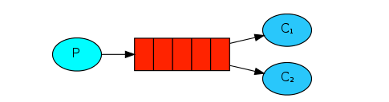

# 工作模式介绍

## Work queues：[工作队列模式](https://www.rabbitmq.com/tutorials/tutorial-two-java.html)

​	
    工作队列模式背后的设计理念主要是为了避免立即执行一个资源资源密集型的任务，并且不得不等待它完成。取而代之的，我们计划将这个任务延期执行。我们将这个任务压缩成一个消息并发送到队列。后台运行的程序会取出这个任务并执行它。当后台有多个执行器时，任务将会在他们之间共享。

​	工作队列模式，默认采用轮询的方式将消息发送给消费者，平均来说，每个消费者都会得到同样数量的消息。需要注意的是，工作队列模式中，一条消息只会被一个消费者消费。

​	我们上篇文章实现的案例其实就是工作队列模式，虽然在上面的图中，没有体现出交换机，在代码中我们也没有声明交换机，但实际上，MQ会使用一个默认的交换机。*默认交换机*(default exchange)实际上是一个由消息代理预先声明好的没有名字(名字为空字符串)的直连交换机(direct exchange）。关于交换机的概念，我们在后面会继续提到，在这里就不多说了。接下来我们看第二种工作模式：

## Publish/Subscribe：[发布订阅模式](<https://www.rabbitmq.com/tutorials/tutorial-three-java.html>)

