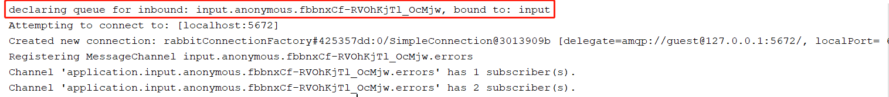
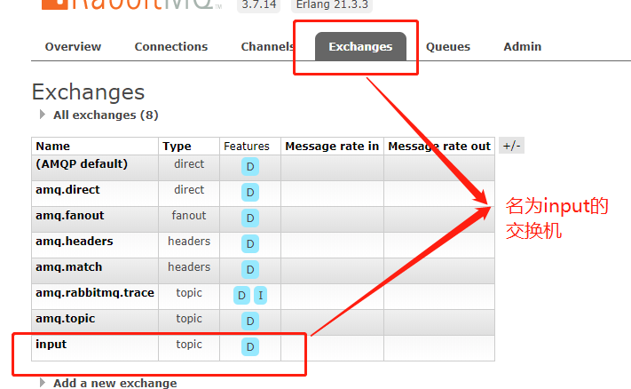
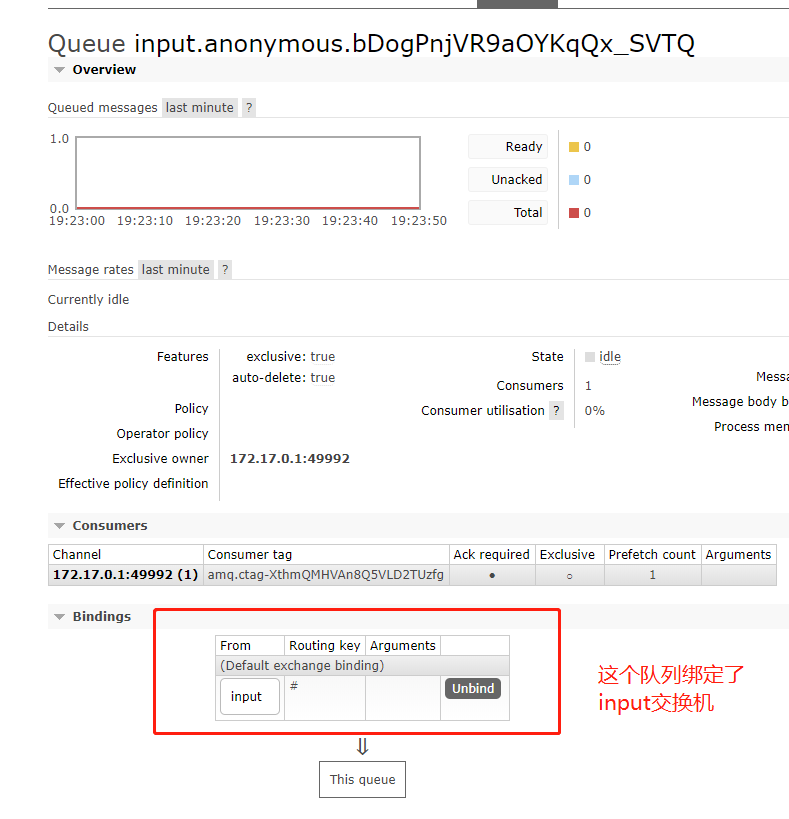
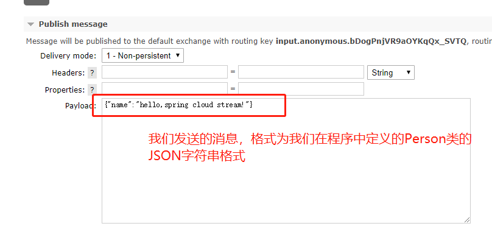
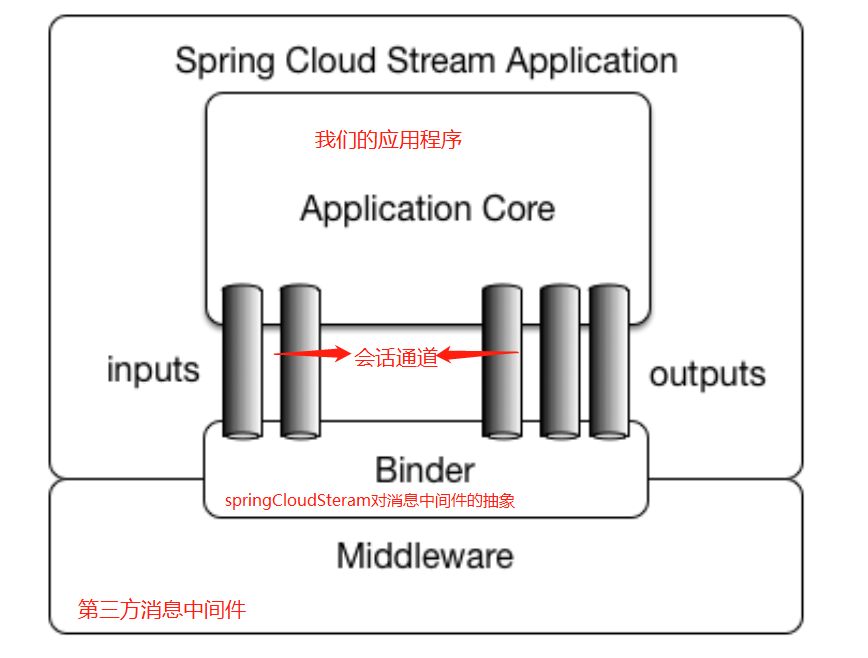

**前言：**

​	在了解完RabbitMQ后，再来学习SpringCloudStream就轻松很多了，SpringCloudStream现在主要支持两种消息中间件，一个是RabbitMQ，还有一个是KafKa，我这里只会介绍RabbitMQ相关的内容

------

**概述：**

​	Spring Cloud Stream是一个为微服务应用构建消息驱动能力的框架。它可以基于Spring Boot来创建独立的，可用于生产的Spring应用程序。它通过使用Spring Integration来连接消息代理中间件以实现消息时间驱动。Spring Cloud Stream 为一些供应商的消息中间件产品提供了个性化的自动化配置实现，并且引入了发布-订阅，消费组，以及分区这个3个概念（后文会详细介绍）。简单来说，Spring Cloud Stream本质上就是整合了Spring Boot 跟 Spring Integration。实现了一套轻量级的消息驱动的微服务框架。

**入门案例：**

​	我这里直接用[官网](<https://cloud.spring.io/spring-cloud-static/spring-cloud-stream/2.2.0.M1/spring-cloud-stream.html#spring-cloud-stream-reference>)的例子：

```java
@SpringBootApplication
@EnableBinding(Sink.class)
public class LoggingConsumerApplication {

	public static void main(String[] args) {
		SpringApplication.run(LoggingConsumerApplication.class, args);
	}

	@StreamListener(Sink.INPUT)
	public void handle(Person person) {
		System.out.println("Received: " + person);
	}

	public static class Person {
		private String name;
		public String getName() {
			return name;
		}
		public void setName(String name) {
			this.name = name;
		}
		public String toString() {
			return this.name;
		}
	}
}
```

​	

​	pom文件

```xml
<dependencies>
        <dependency>
            <groupId>org.springframework.cloud</groupId>
            <artifactId>spring-cloud-stream</artifactId>
        </dependency>

        <dependency>
            <groupId>org.springframework.boot</groupId>
            <artifactId>spring-boot-starter-test</artifactId>
            <scope>test</scope>
        </dependency>
        <dependency>
            <groupId>org.springframework.cloud</groupId>
            <artifactId>spring-cloud-stream-test-support</artifactId>
            <scope>test</scope>
        </dependency>
        <dependency>
            <groupId>org.springframework.cloud</groupId>
            <artifactId>spring-cloud-stream-binder-rabbit</artifactId>
        </dependency>
        <dependency>
            <groupId>org.projectlombok</groupId>
            <artifactId>lombok</artifactId>
        </dependency>
    </dependencies>

    <dependencyManagement>
        <dependencies>
            <dependency>
                <groupId>org.springframework.cloud</groupId>
                <artifactId>spring-cloud-dependencies</artifactId>
                <version>${spring-cloud.version}</version>
                <type>pom</type>
                <scope>import</scope>
            </dependency>
        </dependencies>
    </dependencyManagement>
```

我们不需要做其他任务的配置，启动服务，可以在日志中看到如下的输出：



​	我们可以看到，红线框出的部分代表了，我们申明了一个队列，队列名称为input.anonymous.xxxx,并将其绑定到了名为input的交换机上

​	我们可以到RabbitMQ的管理后台查看以验证我们的结论：

我们查看队列也可以发现：

​	

我们启动程序后，相当于做为一个消费者一直在监听这个队列，我们现在可以尝试直接用MQ后台往这个队列中publish一条消息



可以看到程序输出如下：

```java

```

在上面的例子中，我们用到了这几个注解

1. @EnableBinding(Sink.class)
2. @StreamListener(Sink.INPUT)

还有这个类：

```java

```

我们现在一一介绍下：

​	` @EnableBinding` 注解，该注解用来指定一个或多个定义了`@input`,`@output`注解的接口，以此来实现对消息通道（Channel）的绑定。在上面的例子中，我们通过`@EnableBinding(Sink.class)`，绑定了Sink接口，该接口是Spring Cloud Stream默认实现的对输入消息通道绑定的定义。

​	`@StreamListener(Sink.INPUT)`，这个注解主要的作用是将被修饰的方法注册为消息中间件上数据流的事件监听器.注册中的属性值对应了监听的消息通道名。在上面的例子中，我们通过这个注解将receive方法注册为input消息通道的监听处理器，所以当我们在RabbitMQ的控制页面中发送消息时，receive方法会做出对应的响应动作

​	经过上面的入门案例后，我们对Spring Cloud Stream算是有了一些基础的了解，现在我们继续深入的学习下Spring Cloud Stream，官网中Spring Cloud Stream的应用模型如下（红字是我对这个模型图的理解）：

​	我们之前讲了，Spring Cloud Stream引入了发布-订阅，消费者组，分区这个3个概念。我们现在就这三个概念一起探讨下：

1. 发布-订阅

   Spring Cloud Stream中的消息通信方式遵循了发布-订阅模式，当一条消息被投递到消息中间件后，它会通过共享的Topic主题进行广播，消息消费者在收到消息后，会对它进行自身的业务逻辑处理，这里的Topic其实就是对应了RabbitMQ中的交换机

2. 消费组

   设想这样一种情况，我们有3台服务器，并且都部署了我们应用，并且这3台服务器都是MQ的消费者。假设我们发送了一条用户确认支付的消息，现在服务器应该做的操作是扣减库存。但是问题来了，我们之前已经知道了发布订阅模式，按照现在这种情况，3台服务器都会收到我们的消息，这样的话，扣减库存这一操作就会被执行3次，这样显然是不合理的。可能有的同学会说，我们只将一台服务器注册为MQ的消费者不就行了吗？但是这样是否又违背了高可用的原则呢？对于这种情况，MQ为我们提供了一种更有效的方法，就是消费组。

   我们可以通过`spring.cloud.stream.bindings.通道名称.group=groupName`(在上面的例子就是`spring.cloud.stream.bindings.input.group=groupName`）指定组名，在同一组的消费组，只会有一个实例收到消息

3. 消息分区

   了解了消费组的概念后，我们已经可以做到，在多实例的情况下，可以确保我们的消息只被消费一次。但是，现在我们无法保证消息到底是被哪个消费者消费了，对于同一条消息，它多次到达之后可能是由不同的消费者消费的。但是在有些特定的情况下，我们可能想要一些具有特定特征的消息每次都被同一个消费者消费。这个时候消息生产者可以为消息增加一个固有的特征ID来进行分区，使得拥有这些ID的消息每次能被同一个消费者消费。分区概念的引入就是为了解决这样的问题的：当生产者将消息数据发送到多个消费者实例时，保证拥有共同特征的消息数据始终是由同一个消费者示例接收和处理
4. 消费者类型
    
    2.0版本之后，既支持消息驱动模型（异步），也支持轮询模型（同步）。